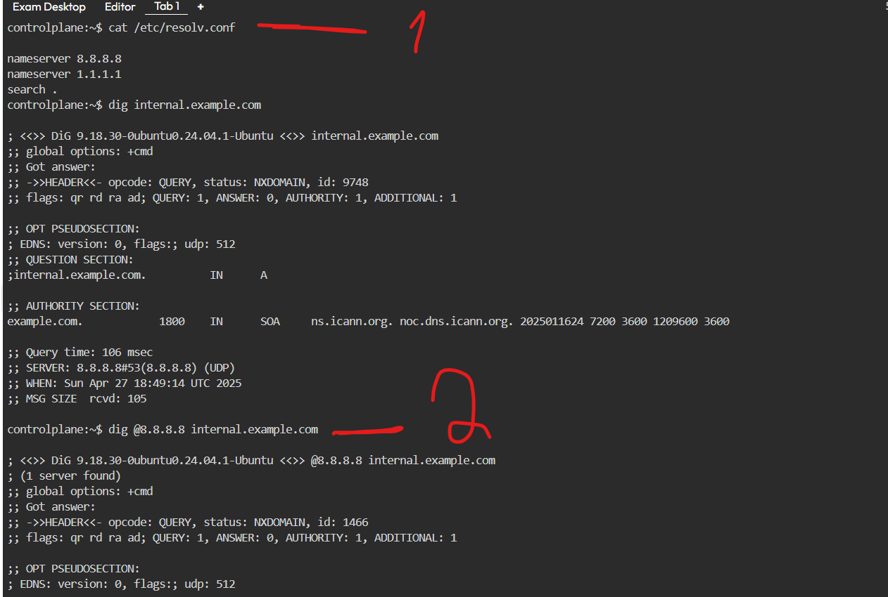
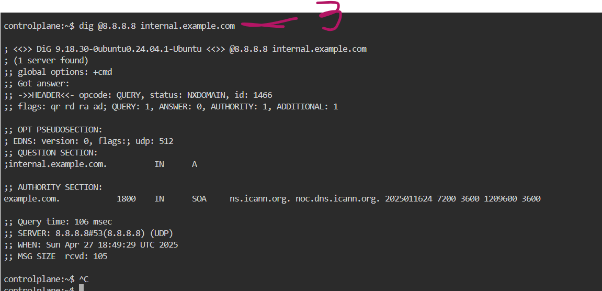
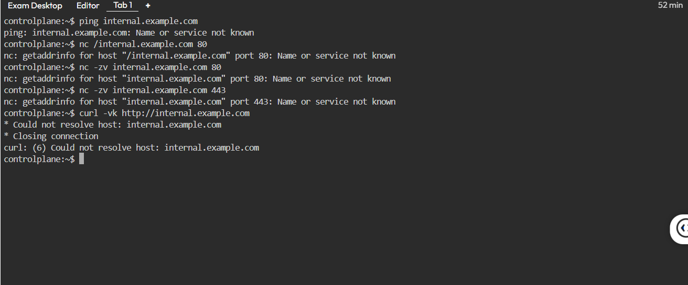

internship task - omar elshall

---

please follow the readme.md carefully  
you can also click on the screenshots i have provided below

---

mygrep.sh (question 1)

small bash script similar to grep  
supports -n to show line numbers and -v to invert matches  
also supports --help to show usage info

---

testing screenshot:

---

reflective section

question 1a:  
the script first checks if the user asked for help  
then it looks at the options like -n or -v or both  
after that it expects the search word and the file name  
if something is missing it shows an error and stops

question 1b:  
if i wanted to support more options like regex or -i or -c or -l  
i would maybe use getopts to make it easier to read  
then depending on the option or counting will change

question 1c:  
the hardest part was making -v and -n work together, and the missing argument part  
but i managed to solve it thanks

---

troubleshooting scenario (question 2)

---

question 2_a - verify dns resolution

i checked /etc/resolv.conf and tried to resolve internal.example.com  
i also tested with 8.8.8.8  
both tests failed as expected because the domain does not exist

screenshots:

  

---

question 2_b - service reachability

i tried to ping internal.example.com but it failed because the domain does not exist  
then i used nc to check if ports 80 and 443 are reachable  
both tests failed which is expected since there is no real server  
i also tried curl to connect to the service but it failed too

screenshot:

---

question 2_c - possible causes

- dns server misconfigured or unreachable  
- wrong dns record for internal.example.com  
- firewall blocking port 80 or 443  
- web server running but only on localhost  
- wrong ip address assigned in dns  
- routing issues between user and server  
- ssl certificate problem on https  
- server up but web service down

---

question 2_d - commands and fixes

if the dns server is wrong  
i would check /etc/resolv.conf and edit it to correct dns like 8.8.8.8

if the dns record is wrong  
i would run dig internal.example.com and fix it on the dns server

if the firewall is blocking  
i would run nc -zv server_ip 80 and 443, then open ports in the firewall

if the web server is listening only on localhost  
i would run netstat -tulnp or ss -tulnp and fix it to listen on 0.0.0.0

if the ip address is wrong  
i would fix the dns a record to the correct ip

if routing issues happen  
i would use ping and traceroute to find where it fails and fix the network

---
